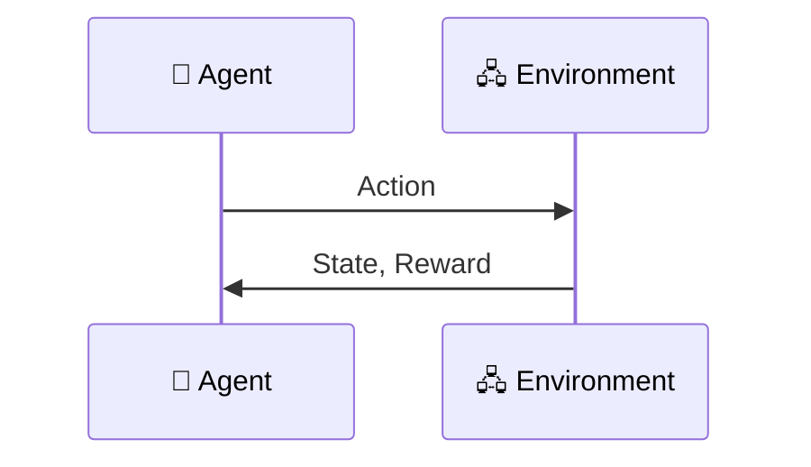

# Reinforcement Learning

[Artificial Intelligence A-Z](https://sds-platform-private.s3-us-east-2.amazonaws.com/uploads/P20-AI-AZ-Handbook-Kickstarter.pdf)

## Table of content

- [Reinforcement Learning](#reinforcement-learning)
- [The Bellman Equation](#the-bellman-equation)
- [The "Plan"](#the-plan)
- [Markov Decision Process(MDP)](#markov-decision-process)
- [Optimal Policy vs Fixed Plans](#optimal-policy-vs-fixed-plans)
- [Living Penalty](#living-penalty)
- [Q-Learning intuition](#q-learning-intuition)
- [Temporal difference](#temporal-difference)

## Reinforcement learning

[Simple Reinforcement Learning in Tensorflow](https://awjuliani.medium.com/simple-reinforcement-learning-with-tensorflow-part-0-q-learning-with-tables-and-neural-networks-d195264329d0)

## The Bellman Equation

Concepts:

- s: State
- s': following State
- a: Action
- R: Reward
- y(gama): Discount
- V(s): Value function (expected future rewards from state)

$$
V(s) = \max_a \left( R(s, a) + \gamma V(s') \right)
$$

|              |         |               | y = 0.9 |
| ------------ | ------- | ------------- | ------- |
| V=0.81 ➡️    | V=0.9➡️ | V=1➡️         | 🎯      |
| V=0.73 ⬆️    | ⬛      | V=0.9 ⬆️➡️⬇️  | 🟥      |
| 🚀 V=0.66 ⬆️ | V=0.73  | V=0.81 ⬅️⬆️➡️ | V=0.73  |

🚀 - start
🎯 - success ( R = 1 )
🟥 - fail ( R = - 1 )
⬛ - forbidden

[The Theory of Dynamic Programming](https://www.rand.org/pubs/papers/P550.html)

## The "Plan"

> The plan is also called the mapping

|     |     |     | the "Plan" |
| --- | --- | --- | ---------- |
| ➡️  | ➡️  | ➡️  | 🎯         |
| ⬆️  | ⬛  | ⬆️  | 🟥         |
| ⬆️  | ➡️  | ⬆️  | ⬅️         |

## Markov Decision Process

### Deterministic vs non-deterministic search

Deterministic meaning you will always get on the new state no matter what.
Non-deterministic meaning randomness come in action. For example if agent wants to go up there is a probability of 10% to land on left state, 10% to land on right and 80% to land on top state as it initially wanted

### Markov Property

An MDP follows the Markov property, meaning that the next state depends only on the current state and action, not on past states.

$$
P(s, a, s', s_{t-1}, a_{t-1}, ...) = P(s, a, s')
$$

**P** - probability

This makes MDPs memory-less, simplifying decision-making.

### MDP

A Markov Decision Process (MDP) is a mathematical framework for decision-making in sequential environments, where outcomes are partially random and partially controlled by an agent.

Taking the probability of 0.1, 0.8, 0.1 we can determine the Value of the next state like following:

$$
V(s')
$$

translates into:

$$
0.8*V(s1') + 0.1*V(s2') + 0.1*V(s3')
$$

> Bellman Equation for State-Value Function

$$
V(s) = \max_a \left[ R(s, a) + \gamma \sum_{s'} P(s, a, s') V(s') \right]
$$

[A Survey of Applications of Markov Decision Processes](https://cs.uml.edu/ecg/uploads/AIfall14/MDPApplications3.pdf)

## Optimal Policy vs Fixed Plans

> A policy (π) is a mapping from states to actions that an agent follows.
> An optimal policy (π\*) is the one that maximizes the expected cumulative reward over time.
> The agent continuously updates its policy as it learns from the environment, making it adaptive to changes.

> A fixed plan is a predefined sequence of actions or rules that an agent follows without dynamically adapting based on learning.
> These are often used in rule-based systems or simple heuristics.
> Limitation: Fixed plans do not adapt to unexpected changes in the environment and can be suboptimal in dynamic settings.

|              |         |               | y = 0.9 |
| ------------ | ------- | ------------- | ------- |
| V=0.81 ➡️    | V=0.9➡️ | V=1➡️         | 🎯      |
| V=0.73 ⬆️    | ⬛      | V=0.9 ⬆️➡️⬇️  | 🟥      |
| 🚀 V=0.66 ⬆️ | V=0.73  | V=0.81 ⬅️⬆️➡️ | V=0.73  |

After introducing some randomness(not being anymore deterministic) the new values becomes

|        |        |        |        |
| ------ | ------ | ------ | ------ |
| V=0.71 | V=0.74 | V=0.86 | 🎯     |
| V=0.63 | ⬛     | V=0.39 | 🟥     |
| V=0.55 | V=0.46 | V=0.36 | V=0.22 |

|     |     |     | "Plan" |
| --- | --- | --- | ------ |
| ➡️  | ➡️  | ➡️  | 🎯     |
| ⬆️  | ⬛  | ⬅️  | 🟥     |
| ⬆️  | ⬅️  | ⬅️  | ⬇️     |

## Living Penalty

> For the living penalty, we add a reward when performing an action(a small negative reward as an example = -0.4) not only in final steps but also on each step. This is intended to find the optimal path in the shortest amount of moves.

|            |         |         | y = 0.9 |
| ---------- | ------- | ------- | ------- |
| R=-0.04    | R=-0.04 | R=-0.04 | 🎯 R=+1 |
| R=-0.04    | ⬛      | R=-0.04 | 🟥 R=-1 |
| 🚀 R=-0.04 | R=-0.04 | R=-0.04 | R=-0.04 |

> 🚀 R=-0.04 - it gets a negative reward not when it starts from this position but for each come back in this position.

> It is called penalty because no matter where it goes it will get a negative reward.

How will optimal policy will change depending on the rewards?

| | | | R(S) = 0 |
| - | - | - | - |
| ➡️ | ➡️ | ➡️ | 🎯 R=+1 |
| ⬆️ | ⬛ | ⬅️ | 🟥 R=-1 |
| 🚀 ⬆️ | ⬅️ | ⬅️ | ⬇️ |

|       |     |     | R(S) = -0.04 |
| ----- | --- | --- | ------------ |
| ➡️    | ➡️  | ➡️  | 🎯 R=+1      |
| ⬆️    | ⬛  | ⬆️  | 🟥 R=-1      |
| 🚀 ⬆️ | ⬅️  | ⬅️  | ⬅️           |

|       |     |     | R(S) = -0.5 |
| ----- | --- | --- | ----------- |
| ➡️    | ➡️  | ➡️  | 🎯 R=+1     |
| ⬆️    | ⬛  | ⬆️  | 🟥 R=-1     |
| 🚀 ⬆️ | ➡️  | ⬆️  | ⬅️          |

|       |     |     | R(S) = -2.0 |
| ----- | --- | --- | ----------- |
| ➡️    | ➡️  | ➡️  | 🎯 R=+1     |
| ⬆️    | ⬛  | ➡️  | 🟥 R=-1     |
| 🚀 ➡️ | ➡️  | ➡️  | ⬆️          |

## Q-Learning intuition

In the previous chapters we've used **V**, the value of being in certain state.

$$
V(s) = \max_a \left[ R(s, a) + \gamma \sum_{s'} P(s, a, s') V(s') \right]
$$

|       |       |       |
| ----- | ----- | ----- |
| ⬛    | V(s2) | 🟥    |
| V(s1) | 🚀    | V(s3) |

---

$$
Q(s,a) = R(s, a) + \gamma \sum_{s'} (P(s, a, s') V(s'))
$$

|       |       |       |
| ----- | ----- | ----- |
| ⬛    | Q(so, a1) | 🟥    |
| Q(s0,a4) | 🚀 ⬅️⬆️⬇️ ➡️  Q(s0, a3) | Q(s0, a2) |

**Q** might be as terminology for "quality" but this is not official term.

> Replacing V of next state with Q to obtain Bellman equation for Q value

$$
Q(s,a) = R(s, a) + \gamma \sum_{s'} (P(s, a, s')  \max_{a'} Q(s', a'))
$$

[Markov Decision Process: Concepts and Algorithms by Martijn van Otterlo(2009)](https://citeseerx.ist.psu.edu/document?repid=rep1&type=pdf&doi=968bab782e52faf0f7957ca0f38b9e9078454afe)

## Temporal difference

> Temporal difference is the heart and soul of Q-Learning algorithm this allow the agent to calculate the **V/Q** values.
> Formula with stocasticity (randomness) - probabilistic approach

$$
Q(s,a) = R(s, a) + \gamma \sum_{s'} \left(P(s, a, s')  \max_{a'} Q(s', a')\right)
$$

> Simplified formula in deterministic mode
$$
Q(s,a) = R(s, a) + \gamma \max_{a'} Q(s', a')
$$

|       |     |     | |
| - | -| - | - |
|   |  |  | 🎯 R=+1     |
| ⬆️ Q(s,a)   | ⬛  |  | 🟥 R=-1     |
|  |  |  |          |

> Before: we know Q(s,a) from previous calculation
> After: we need to calculate new value
$$
\gamma \max_{a'} Q(s', a')
$$

> Temporal difference becomes
$$
TD(a,s) = R(s, a) + \gamma \max_{a'} Q(s', a') - Q(s,a)
$$

> **You are basically calculating the value of Q in a state with an action that varies in time!**

$$
Q(s,a) = Q(s, a) + \alpha TD(a,s)
$$

**α** = learning rate

> Q Value with Temporal Difference

$$
TD(a,s) = R(s, a) + \gamma \max_{a'} Q(s', a') - Q_{t-1}(s,a)
$$
$$
Q_t(s,a) = Q_{t-1}(s, a) + \alpha TD_{t}(a,s)
$$

**t** = current time
**t-1** = previous time

> The full equation becomes

$$
Q_t(s,a) = Q_{t-1}(s, a) + \alpha \left[ R(s, a) + \gamma \max_{a'} Q(s', a') - Q_{t-1}(s,a)\right]
$$

[Learning to predict by the methods of temporal differences](https://link.springer.com/article/10.1007/BF00115009)
