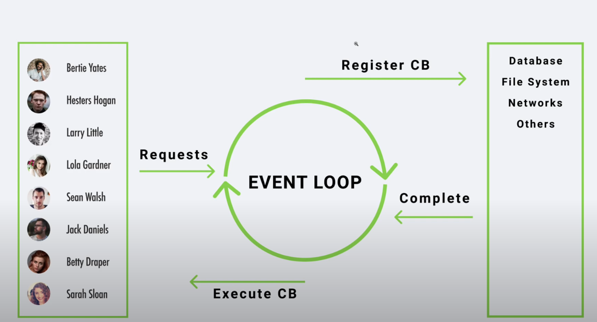

# Practice from freeCodeCamp.org youtube tutorials

> https://www.youtube.com/watch?v=Oe421EPjeBE

> https://www.youtube.com/watch?v=qwfE7fSVaZM

## Globals - NO WINDOW!

`__dirname` - path to current dir
`__filename` - file name
`require` - fuction to use modules(CommonJS)
`module` - info about current module(file)
`process` - info about env where the progam is being executed

## Modules

> Node uses CommonJS as default => every file is a module(by default)

```javascript
const quantity = 5;
const user = 'John';

const sayHi = (name) => {
    console.log(`Hi ${name}`);
};

// exporting
module.exports = { quantity, user };
module.exports = sayHi;

// to import use:
// const myModule = require('./fullpath');
// console.log(myModule.quantity)
```

### > os module <

> require('os')

> os.userInfo()

> os.uptime()

### > path module <

> require('path')

> path.sep

> path.join()

> path.basename() - name of the file

> path.resolve(\_\_dirname, 'example', 'my.txt') - return absolute path

### > fs module sync <

> const {readFileSync, writeFileSync} = require('fs')

> const content = readFileSync(path, 'utf8')

> writeFileSync(path, content, {flag: 'a'})

### > fs module async <

> const {readFile, writeFile} = require('fs')

> readFile(path, encoding, (err, result) => {}) -> result -> content of read

> writeFile(path, whatToWrite, (err, result) => {})

### > http module <

> const http = require('http')

> const server = http.createServer( (req, res) => { res.end('hi') } )

> server.listen(PORT)

### > util module <

> require('util')

> const {readFile} = require('fs')

> const readFilePromise = util.promisify(readFile)

Same result can be obtain by using:

> const {readFile} = require('fs').promises

## NPM

> https://nodesource.com/blog/the-basics-of-package-json-in-node-js-and-npm/

## Event loop browser vs NodeJs

> https://www.youtube.com/watch?v=8aGhZQkoFbQ

> https://www.youtube.com/watch?v=PNa9OMajw9w



## Events

> https://medium.com/developers-arena/nodejs-event-emitters-for-beginners-and-for-experts-591e3368fdd2

> https://www.freecodecamp.org/news/how-to-code-your-own-event-emitter-in-node-js-a-step-by-step-guide-e13b7e7908e1/

> https://www.youtube.com/watch?v=9ErAONqE6HE

```javascript
const EventEmitter = require('events');
const customEmmitter = new EventEmitter();

customEmmitter.on('response', (name, id) => {
    console.log(`data recieved user: ${name} with id: ${id}`);
});
customEmmitter.on('response', () => {
    console.log('some other logic');
});

customEmmitter.emit('response', 'jhon', 34);
```

## Streams

-   Writeable
-   Readable
-   Duplex
-   Transform

> require('fs')

> createReadStream()

> createWriteStream()
