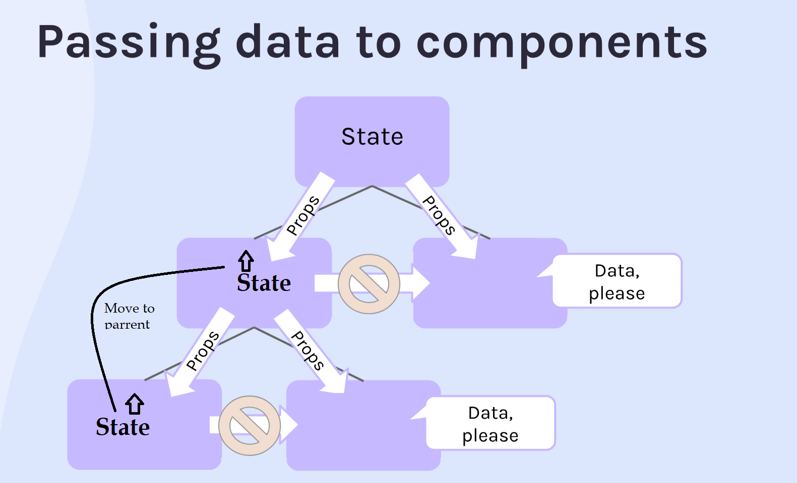

# React notes

> https://react.dev/learn

---

## JSX

> https://react.dev/learn/writing-markup-with-jsx

```
const element = <h1>Hello, world!</h1>;
```

This funny tag syntax is neither a string nor HTML. It is called JSX, and it is a syntax extension to JavaScript. JSX produces React “elements

> JSX returns plain JAVASCRIPT objects

### Quiz

1. Why do we need to `import React from "react"` in our files?
   React is what defines JSX

2. If I were to console.log(page) in index.js, what would show up?
   A JavaScript object. React elements that describe what React should eventually add to the real DOM for us.

3. What's wrong with this code:

```
const page = (
    <h1>Hello</h1>
    <p>This is my website!</p>
)
```

We need our JSX to be nested under a single parent element. Fixed:

```
const page = (
    <div>
    <h1>Hello</h1>
    <p>This is my website!</p>
    </div>
)
```

4. What does it mean for something to be "declarative" instead of "imperative"?
   Declarative means I can tell the computer WHAT to do and expect it to handle the details.
   Imperative means I need to tell it HOW to do each step.

5. What does it mean for something to be "composable"?
   We have small pieces that we can put together to make something larger/greater than the individual pieces.

---

### React Components

A function or class that returns a JAVASCRIPT object containing JSX code. This represents your HTML elements grouped under a div tag. We use components for modularity, reusability.

### Create react app with vite

> Vite is a tool for creating FE apps

```
$npm create vite@latest
```

> Classic

```
$npx create-react-app app-name
```

### Quiz

1. What is a React component?
   A function that returns React elements( javascript object containing JSX code). (UI)

2. What's wrong with this code?

```
function myComponent() {
    return (
        <small>I'm tiny text!</small>
    )
}
```

> FIX

```
function MyComponent()
```

3. What's wrong with this code?

```
function Header() {
    return (
        <header>
            <nav>
                
            </nav>
        </header>
    )
}

ReactDOM.render(Header(), document.getElementById("root"))
```

> FIX

```
ReactDOM.render(<Header/>, document.getElementById("root"))
```

---

## Props

Props are arguments passed into React components. Props are passed to components via HTML attributes.

```
const myElement = <Car brand="Ford" />
```

> **brand** is a prop

### Passing non-string props

```
<Joke
    punchline="It’s hard to explain puns to kleptomaniacs because they always take things literally."
    isPun={true}
    upvotes={10}
    downvotes={2}
    comments={[{author: "", body: "", title: ""}, {...}]}
/>
```

> upvotes, downvotes, isPun, comments will be Number, boolean, array when obtain by **props.isPun** etc...

### Quiz

1. What do props help us accomplish?
   Make a component more reusable.

2. How do you pass a prop into a component?

```
 <MyAwesomeHeader title="???" />
```

3. Can I pass a custom prop (e.g. `blahblahblah={true}`) to a native DOM element? (e.g. <div blahblahblah {true}>) Why or why not?

No, because the JSX we use to describe native DOM elements will be turned into REAL DOM elements by React. And real DOM elements only have the properties/attributes specified in the HTML specification. (Which doesn't include properties like `blahblahblah`)

4. How do I receive props in a component?

```
function Navbar(props) {
    console.log(props.blahblahblah)
    return (
        <header>
            ...
        </header>
    )
}
```

5. What data type is `props` when the component receives it?
   An object!

### React render arrays / Mapping components

> You can map javascript objects to obtain the JSX elements.

```
export default function App() {
 const jokeElements = jokesData.map((joke) => {
        return <Jokes setup={joke.setup} punchline={joke.punchline} />;
    });

 return <div className="App">{jokeElements}</div>;
}
```

### Quiz

1. What does the `.map()` array method do?
   Returns a new array. Whatever gets returned from the callback function provided is placed at the same index in the new array. Usually we take the items from the original array and modify them in some way.

```
const capitalized = names.map((name) => {
    return name[0].toUpperCase() + name.slice(1)
})
```

2. What do we usually use `.map()` for in React?
   Convert an array of raw data into an array of JSX elements that can be displayed on the page.

```
const pokemon = ["Bulbasaur", "Charmander", "Squirtle"]
const paragraphs = pokemon.map(mon => `<p>${mon}</p>`)
```

3. Why is using `.map()` better than just creating the components manually by typing them out?
   It makes our code more "self-sustaining" - not requiring additional changes whenever the data changes.

### Fix key prop warning

> Fixing warning: react-jsx-dev-runtime.development.js:85 Warning: Each child in a list should have a unique "key" prop.

```
<Card key={item.id} img={item.coverImg}/>
```

> Just add **key** as prop with value some unique value(in our case id)

### Conditional rendering

> Render UI elements based on prop conditions

```
export default function Card(props) {
  let badgeText = "";
  if (props.openSpots === 0) {
    badgeText = "SOLD OUT";
  } else if (props.country === "Online") {
    badgeText = "ONLINE";
  }
  return (
    <div className="card">
      {badgeText !== "" && <div className="card--badge">{badgeText}</div>}
    </div>
  );
}
```

## Adding event listener to buttons in React

> https://legacy.reactjs.org/docs/events.html#mouse-events

```
 return (
        <button className="form--button" onClick={handleClick}>
          Get a new meme image 🖼
        </button>
  );
```

---

## React State

### Changing state of array

```
import React from 'react';
import ReactDOM from 'react-dom';

function App() {
    const [things, setThings] = React.useState(["Thing 1", "Thing 2"])

    function addItem() {
        const newThingText = `Thing ${things.length + 1}`
        setThings(prevState => [...prevState, newThingText])
    }

    const thingsElements = things.map(thing => <p key={thing}>{thing}</p>)

    return (
        <div>
            <button onClick={addItem}>Add Item</button>
            {thingsElements}
        </div>
    )
}

ReactDOM.render(<App />, document.getElementById('root'));
```

> We create a state using **React.useState()** - this is a hook in react.

### Yes/No button example

```
export default function App() {
    const [isImportant, setIsImportant] = React.useState("Yes")

    function handleClick() {
        setIsImportant("No")
    }

    return (
        <div className="state">
            <h1 className="state--title">Is state important to know?</h1>
            <div className="state--value" onClick={handleClick}>
                <h1>{isImportant}</h1>
            </div>
        </div>
    )
}
```

> **"Yes"** is the default/initial value for the state, **isImportant** is the state value that we are changing and **setIsImportant** is the function that modify the value of isImportant

### Counter increment example

```
import React from "react"
export default function App() {
    const [counter, setCounter] = React.useState(0)
    function incrementCounter() {
        setCounter(counter+1);
    }
    function decrementCounter() {
        setCounter(counter-1);
    }
    return (
        <div className="counter">
            <button className="counter--minus" onClick={decrementCounter}>–</button>
            <div className="counter--count">
                <h1>{count}</h1>
            </div>
            <button className="counter--plus" onClick={incrementCounter}>+</button>
        </div>
    )
}
```

> Avoid using **setCounter(counter++)**. This is a violation that change the value by yourself of the state. React doesn't allow this and you should let React increment de value.

> Note: if you ever need the old value of state to help you determine the new value of state, you should pass a callback function to your state setter function **instead of using state directly**. This callback function will receive the old value of state as its parameter, which you can then use to determine your new value of state.

```
 function incrementCounter(){
    setCounter(function(oldValue) {
        return oldValue+1
    })
```

or

```
 function incrementCounter(){
    setCounter(prev => prev +1 )
```

### Complex state: arrays

```
import React from 'react';
import ReactDOM from 'react-dom';
function App() {
    const [thingsArray, setThingsArray] = React.useState(["Thing 1", "Thing 2"])
    function addItem() {
        setThingsArray(prevState => {
            return [...prevState, `Thing ${prevState.length + 1}`]
        })
    }
    const thingsElements = thingsArray.map(thing => <p key={thing}>{thing}</p>)
    return (
        <div>
            <button onClick={addItem}>Add Item</button>
            {thingsElements}
        </div>
    )
}
ReactDOM.render(<App />, document.getElementById('root'));
```

> ! Remember to **NOT** do setThingsArray(prevState => prevState.push(`Thing ${prevState.length + 0}`) because this change directly the state, so use spread operator to make a copy.

### Complex state: objects

```
import React from "react"
export default function App() {
    const [contact, setContact] = React.useState({
        firstName: "John",
        lastName: "Doe",
        phone: "+1 (719) 555-1212",
        email: "itsmyrealname@example.com",
        isFavorite: false
    })
    let starIcon = contact.isFavorite ? "star-filled.png" : "star-empty.png"
    function toggleFavorite() {
        setContact(prevContact => ({
            ...prevContact,
            isFavorite: !prevContact.isFavorite
        }))
    }
    return (
        <main>
            <article className="card">
                
                <div className="card--info">
                    
                    <h2 className="card--name">
                        {contact.firstName} {contact.lastName}
                    </h2>
                    <p className="card--contact">{contact.phone}</p>
                    <p className="card--contact">{contact.email}</p>
                </div>
            </article>
        </main>
    )
}
```

### Passing state as props

```
import React from "react"
export default function App() {
    const [count, setCount] = React.useState(0)
    function add() {
        setCount(prevCount => prevCount + 1)
    }
    function subtract() {
        setCount(prevCount => prevCount - 1)
    }
    return (
        <div className="counter">
            <button className="counter--minus" onClick={subtract}>–</button>
            <div className="counter--count">
                <h1>{count}</h1>
            </div>
            <button className="counter--plus" onClick={add}>+</button>
        </div>
    )
}
```

> Newly component & how to pass state as props

```
export default function Count(props) {
    return (
        <div className="counter--count">
            <h1>{props.number}</h1>
        </div>
    )
}

// Pass state as prop

    return (
        <div className="counter">
            <button className="counter--minus" onClick={subtract}>–</button>
            <Count number={count} />
            <button className="counter--plus" onClick={add}>+</button>
        </div>
    )
```

### Changing parent component state

```
import React from "react"
import Star from "./Star"

export default function App() {
    const [contact, setContact] = React.useState({
        firstName: "John",
        lastName: "Doe",
        phone: "+1 (719) 555-1212",
        email: "itsmyrealname@example.com",
        isFavorite: true
    })

    function toggleFavorite() {
        setContact(prevContact => ({
            ...prevContact,
            isFavorite: !prevContact.isFavorite
        }))
    }

    return (
        <main>
            <article className="card">
                
                <div className="card--info">
                    <Star isFilled={contact.isFavorite} handleClick={toggleFavorite} />
                    <h2 className="card--name">
                        {contact.firstName} {contact.lastName}
                    </h2>
                    <p className="card--contact">{contact.phone}</p>
                    <p className="card--contact">{contact.email}</p>
                </div>
            </article>
        </main>
    )
}
```

> Card.js

```
import React from "react"
export default function Star(props) {
    const starIcon = props.isFilled ? "star-filled.png" : "star-empty.png"
    return (
        
    )
}
```

### Passing data to child components



### Dynamic styles

```
import React from "react"
import boxes from "./boxes"

export default function App(props) {
    const [squares, setSquares] = React.useState(boxes)
    const styles = {
        //backgroundColor: "black"
        backgroundColor: props.darkMode ? "#222222": "#cccccc"
    }

    const squareElements = squares.map(square => (
        <div style={styles} className="box" key={square.id}></div>
    ))
    return (
        <main>
            {squareElements}
        </main>
    )
}
```

### Advices

> Incoming props should always be immutable and never changed. We can see props as properties pass to a component to configure it.

> States refers to values that are managed by the component similar to variables declared inside a function. Changing values in component should be handle by state

### Quiz

1. How would you describe the concept of "state"?
   A way for React to remember saved values from within a component.
   This is similar to declaring variables from within a component, with a few added bonuses (which we'll get to later).

2. When would you want to use props instead of state?
   Anytime you want to pass data into a component so that component can determine what will get displayed on the screen.

3. When would you want to use state instead of props?
   Anytime you want a component to maintain some values from within the component. (And "remember" those values even when React re-renders the component).

4. What does "immutable" mean? Are props immutable? Is state immutable?
   Unchanging. Props are immutable. State is mutable.

5. You have 2 options for what you can pass into a state setter function (e.g. `setCount`). What are they?
   a. New value of state (setCount(42))
   b. Callback function - whatever the callback function
   returns === new value of state

6. When would you want to pass the first option (from answer above) to the state setter function?
   Whenever you don't need the previous value of state to determine what the new value of state should be.

7. When would you want to pass the second option (from answer above) to the state setter function?
   Whenever you DO need the previous value to determine the new value

8. What is "conditional rendering"?
   When we want to only sometimes display something on the page based on a condition of some sort

9. When would you use &&?
   When you want to either display something or NOT display it. If the condition is truly than component will be displayed

10. When would you use a ternary?
    When you need to decide which thing among 2 options to display

11. What if you need to decide between > 2 options on what to display?
    Use an `if...else if... else` conditional or a `switch` statement

```
function App() {
    let someVar
    if () {
        someVar = <SomeJSX />
    } else if() {
        ...
    } else {
        ...
    }
    return (
        <div>{someVar}</div>
    )
}
```

---

## React forms

> https://legacy.reactjs.org/docs/forms.html

> Tips: **name** in form element needs to match the property in state: eg. we have in state {firstName: ""} this mean \<input type="text" **name="firstName"**\>

### Input changes in React

```
import React from "react"
export default function Form() {
    const [formData, setFormData] = React.useState(
        {firstName: "", lastName: ""}
    )
    function handleChange(event) {
        setFormData(prevFormData => {
            return {
                ...prevFormData,
                [event.target.name]: event.target.value
            }
        })
    }
    return (
        <form>
            <input
                type="text"
                placeholder="First Name"
                onChange={handleChange}
                name="firstName"
            />
            <input
                type="text"
                placeholder="Last Name"
                onChange={handleChange}
                name="lastName"
            />
        </form>
    )
}
```

> **[event.target.name]** [ES6 Computed Properties](https://www.javascripttutorial.net/es6/javascript-computed-property/): surround keys with [] to turn dynamic strings. something saved in a variable as property in an object.

### Controlled components

> https://legacy.reactjs.org/docs/forms.html#controlled-components

```
import React from "react"

export default function Form() {
    const [formData, setFormData] = React.useState(
        {firstName: "", lastName: "", email: ""}
    )

    function handleChange(event) {
        setFormData(prevFormData => {
            return {
                ...prevFormData,
                [event.target.name]: event.target.value
            }
        })
    }

    return (
        <form>
            <input
                type="text"
                placeholder="First Name"
                onChange={handleChange}
                name="firstName"
                value={formData.firstName}
            />
            <input
                type="text"
                placeholder="Last Name"
                onChange={handleChange}
                name="lastName"
                value={formData.lastName}
            />
            <input
                type="email"
                placeholder="Email"
                onChange={handleChange}
                name="email"
                value={formData.email}
            />
        </form>
    )
}
```

> Key here is that we add **value** for all inputs. this way we make sure we maintain one source of truth and input html control will have all the time its state value.

### Textarea

```
<textarea value={formData.textArea}/>
```

> Main difference here from classic Textarea form element is that in react there is no closing element so this is self closing. Also to be notice this one doesn't need type even it behave like input

### Checkboxes

```
const [formData, setFormData] = React.useState(
        {
            firstName: "",
            lastName: "",
            email: "",
            comments: "",
            isFriendly: true
        }
    )

function handleChange(event) {
        const {name, value, type, checked} = event.target
        setFormData(prevFormData => {
            return {
                ...prevFormData,
                [name]: type === "checkbox" ? checked : value
            }
        })
    }

...

<input
    type="checkbox"
    id="isFriendly"
    checked={formData.isFriendly}
    onChange={handleChange}
    name="isFriendly"
/>
<label htmlFor="isFriendly">Are you friendly?</label>
```

> Key here is that checkboxes don't have a **value** property, it has **checked** so the input type will determine what will be used to set the state, value or checked **[name]: type === "checkbox" ? checked : value**

### Radio Buttons

```
const [formData, setFormData] = React.useState(
        {
            firstName: "",
            lastName: "",
            email: "",
            comments: "",
            isFriendly: true,
            employment: ""
        }
    )
...
<fieldset>
                <legend>Current employment status</legend>
                <input
                    type="radio"
                    id="unemployed"
                    name="employment"
                    value="unemployed"
                    checked={formData.employment === "unemployed"}
                    onChange={handleChange}
                />
                <label htmlFor="unemployed">Unemployed</label>
                <br />

                <input
                    type="radio"
                    id="part-time"
                    name="employment"
                    value="part-time"
                    checked={formData.employment === "part-time"}
                    onChange={handleChange}
                />
                <label htmlFor="part-time">Part-time</label>
                <br />

                <input
                    type="radio"
                    id="full-time"
                    name="employment"
                    value="full-time"
                    checked={formData.employment === "full-time"}
                    onChange={handleChange}
                />
                <label htmlFor="full-time">Full-time</label>
                <br />

            </fieldset>
```

> Radio buttons are a combination of input text and checkboxes. therefore they will have value(text) and checked state.

> In order to have only one radio button at a time selected you gave to all radio buttons the same **name** (similar to what we do in HTML)

> **checked={formData.employment === "part-time"}** without this check the selection will be buggy in React. We use checked to let React manage this component

### Select boxes

```
 const [formData, setFormData] = React.useState(
        {
            firstName: "",
            lastName: "",
            email: "",
            comments: "",
            isFriendly: true,
            employment: "",
            favColor: ""
        }
    )

...
 <label htmlFor="favColor">What is your favorite color?</label>
            <br />
            <select
                id="favColor"
                value={formData.favColor}
                onChange={handleChange}
                name="favColor">
                <option value="">--Choose--</option>
                <option value="red">Red</option>
                <option value="orange">Orange</option>
                <option value="yellow">Yellow</option>
                <option value="green">Green</option>
                <option value="blue">Blue</option>
                <option value="indigo">Indigo</option>
                <option value="violet">Violet</option>
            </select>

```

### Submit a form

```
...
function handleSubmit(event) {
    event.preventDefault()
    // submitToApi(formData)
    console.log(formData)
}
...
<form onSubmit={handleSubmit}>
...
<button>Submit</button>
</form>
```

> **button** by default is a **submit** type button. if you want to change it to not be submit just use **type=button**

> **event.preventDefault()** will not refresh the page and clear the form.
> **without preventDefault** the url would become: _/index.html?firstName=asdasd&lastName=asdasd&email=&comments=&isFriendly=on&favColor=red_

### Quiz

1. In a vanilla JS app, at what point in the form submission process do you gather all the data from the filled-out form?
   Right before the form is submitted.

2. In a React app, when do you gather all the data from the filled-out form?
   As the form is being filled out. The data is all held in local state.

3. Which attribute in the form elements (value, name, onChange, etc.) should match the property name being held in state for that input?
   `name` property.

4. What's different about saving the data from a checkbox element vs. other form elements?
   A checkbox uses the `checked` property to determine what should be saved in state. Other form elements use the `value` property instead.

5. How do you watch for a form submit? How can you trigger a form submit?
   -Can watch for the submit with an onSubmit handler on the `form` element.
   -Can trigger the form submit with a button click.

---

## Getting data from api

1. Getting data: fetch/axios or any library
2. Save data and save it to state

```
import React from "react"
export default function App() {
    const [starWarsData, setStarWarsData] = React.useState({})

    // console.log("Component rendered")

    fetch("https://swapi.dev/api/people/1")
        .then(res => res.json())
        .then(data => setStarWarsData(data))

    return (
        <div>
            <pre>{JSON.stringify(starWarsData, null, 2)}</pre>
        </div>
    )
}
```

> Any time the component is rendering there is a fetch that is updating the state by setStarWarsData and makes rendering this component infinitely.

### Handling this kind of side effects in react

What are React's primary tasks?

-   work with the DOM/browser to render UI to the page
-   manage state for us between render cycles(i.e. state values are "remembered" from one render to the next)
-   keep the UI updated whenever state changes

What **can't** React handle on its own?

-   out(side) effects!
    -   localStorage
    -   API/database interactions
    -   subscripts(ig. web sockets)
    -   syncing 2 different internal states together
    -   basically anything that React isn't in charge of

For this situations React comes with a hook called **useEffect()**. This is a tool that let us synchronize React state with outside systems.

> https://legacy.reactjs.org/docs/hooks-effect.html

> https://overreacted.io/a-complete-guide-to-useeffect/

### useEffect() syntax default behavior & dependency array

```
   React.useEffect(function() {
        fetch("https://swapi.dev/api/people/1")
            .then(res => res.json())
            .then(data => console.log(data))
    }, ????)
```

> The default behavior wont prevent rendering infinitely because useEffect only guarantees that this hook is called after the component are renderer on the screen. This will require a second parameter here: **????**. Even this is optional you will almost need it :) and that's the **dependency array**

```
   React.useEffect(function() {
        fetch("https://swapi.dev/api/people/1")
            .then(res => res.json())
            .then(data => console.log(data))
    }, [])
```

> This will limit the number of time this effect will run, determines when this effect will run. **[]** will run the effect on the very first render of my component and then there is no dependency to watch to trigger effect again.

```
   const [starWarsData, setStarWarsData] = React.useState({})
   const [count, setCount] = React.useState(1)
   React.useEffect(function() {
        fetch("https://swapi.dev/api/people/${count}")
            .then(res => res.json())
            .then(data => setStarWarsData(data))
    }, [count]
```

> compare previous array render to new array => if different will run the effect again.

### Quiz

1. What is a "side effect" in React? What are some examples?

-   Any code that affects an outside system.
-   local storage, API, web-sockets, two states to keep in sync

2. What is NOT a "side effect" in React? Examples?

-   Anything that React is in charge of.
-   Maintaining state, keeping the UI in sync with the data,
    render DOM elements

3. When does React run your useEffect function? When does it NOT run the effect function?

-   As soon as the component loads (first render)
-   On every re-render of the component (assuming no dependencies array)
-   Will NOT run the effect when the values of the dependencies in the
    array stay the same between renders

4. How would you explain what the "dependencies array" is?

-   Second parameter to the useEffect function
-   A way for React to know whether it should re-run the effect function

### State & Effect practice

> App.js

```
import React from "react"
import WindowTracker from "./WindowTracker"

export default function App() {
    /**
     * Challenge:
     * 1. Create state called `show`, default to `true`
     * 2. When the button is clicked, toggle `show`
     * 3. Only display `<WindowTracker>` if `show` is `true`
     */

    const [show, setShow] = React.useState(true)

    function toggle() {
        setShow(prevShow => !prevShow)
    }

    return (
        <div className="container">
            <button onClick={toggle}>
                Toggle WindowTracker
            </button>
            {show && <WindowTracker />}
        </div>
    )
}
```

> WindowTracker.js

```
import React from "react"

export default function WindowTracker() {

    const [windowWidth, setWindowWidth] = React.useState(window.innerWidth)

    React.useEffect(() => {
        window.addEventListener("resize", function() {
            setWindowWidth(window.innerWidth)
        })
    }, [])

    return (
        <h1>Window width: {windowWidth}</h1>
    )
}
```

> If h1 is not displayed this will cause a memory leak because we set an event listener on something thats not render.

```
    React.useEffect(() => {
        function watchWidth() {
            setWindowWidth(window.innerWidth)
        }
        window.addEventListener("resize", watchWidth )
        return function() {
             window.removeEventListener("resize", watchWidth)
        }
    }, [])
```

### Using an async function inside use effect

> **useEffect** takes a function as its parameter. If that function returns something, it needs to be a cleanup function. Otherwise, it should return nothing. If we make it an async function, it automatically returns a promise instead of a function or nothing. Therefore, if you want to use async operations inside of useEffect, you need to define the function separately inside of the callback function, as seen below:

```
React.useEffect(() => {
    async function getMemes() {
        const res = await fetch("https://api.imgflip.com/get_memes")
        const data = await res.json()
        setAllMemes(data.data.memes)
    }
    getMemes()
}, [])
```
