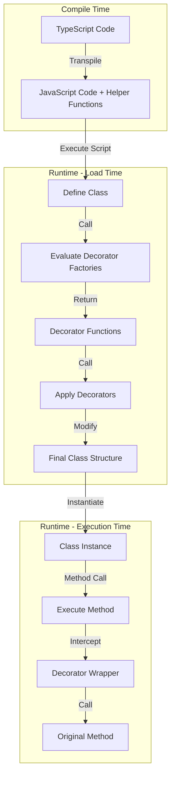
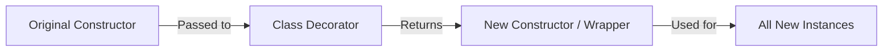
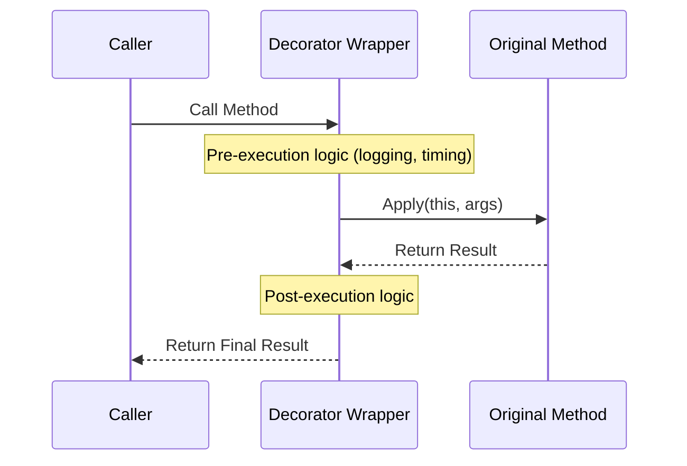
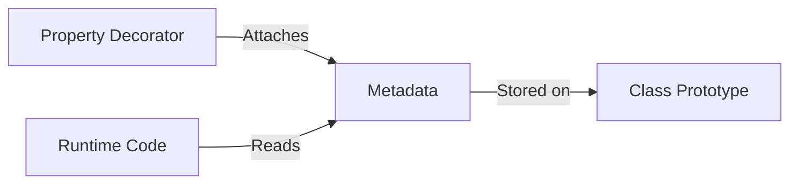

# Understanding TypeScript Decorators

Decorators are a special kind of declaration that can be attached to a class declaration, method, accessor, property, or parameter. Decorators use the form `@expression`, where `expression` must evaluate to a function that will be called at runtime with information about the decorated declaration.

To use decorators in TypeScript, you must enable the `experimentalDecorators` compiler option in your `tsconfig.json`.

> [!NOTE]
> This guide covers **Experimental Decorators** (legacy), which are widely used in frameworks like Angular and NestJS. The newer ECMAScript standard decorators have a different API.

## Core Concepts

### 1. Execution Timing
It is crucial to understand *when* decorators run.



1.  **Compile Time**: TypeScript compiles your code. Decorators are transpiled into helper functions (like `__decorate`). No decorator code executes yet.
2.  **Runtime (Load Time)**: When the JavaScript file is imported/loaded by the runtime (Node.js or Browser), the class definition is executed. **This is when decorators run.** They receive the class or method as an argument and can modify it. This happens *once* per class definition.
3.  **Runtime (Execution Time)**: When you create an instance (`new MyClass()`) or call a method (`instance.method()`), the *result* of the decorator (e.g., the wrapper function) is executed.

### 2. Composition & Order of Execution
Multiple decorators can be applied to a declaration:

```typescript
@f
@g
@h
method() {}
```

They are evaluated similar to function composition: `f(g(h(x)))`.

1.  **Factories are evaluated Top-to-Bottom**: If you use decorator factories (`@f()`), the factory functions are called in order.
2.  **Decorators are called Bottom-to-Up**: The actual decorator functions returned by the factories are called in reverse order (closest to the method first).

#### Example: Order of Execution

```typescript
function Trace(name: string) {
  console.log(`Factory: ${name} (1. Evaluated)`);
  return function (target: any, propertyKey: string, descriptor: PropertyDescriptor) {
    console.log(`Decorator: ${name} (2. Called)`);
    const originalMethod = descriptor.value;
    descriptor.value = function (...args: any[]) {
      console.log(`Wrapper (Before): ${name} (3. Method Called)`);
      const result = originalMethod.apply(this, args);
      console.log(`Wrapper (After): ${name} (4. Method Returned)`);
      return result;
    };
  };
}

class Example {
  @Trace("A")
  @Trace("B")
  @Trace("C")
  method() {
    console.log("  --> Original Method Body");
  }
}

const e = new Example();
e.method();
```

**Output:**

```text
Factory: A (1. Evaluated)
Factory: B (1. Evaluated)
Factory: C (1. Evaluated)
Decorator: C (2. Called)
Decorator: B (2. Called)
Decorator: A (2. Called)
Wrapper (Before): A (3. Method Called)
Wrapper (Before): B (3. Method Called)
Wrapper (Before): C (3. Method Called)
  --> Original Method Body
Wrapper (After): C (4. Method Returned)
Wrapper (After): B (4. Method Returned)
Wrapper (After): A (4. Method Returned)
```

### 3. Decorator Factories
If you want to customize how a decorator is applied to a declaration, you can write a decorator factory. A decorator factory is simply a function that returns the expression that will be called by the decorator at runtime.

```typescript
function color(value: string) {
  // This is the decorator factory, it sets up the returned decorator
  return function (target) {
    // This is the decorator
    // do something with 'target' and 'value'...
  };
}
```

### 4. Static vs Instance Targets
A common point of confusion is the `target` argument:
- For **Static Members**: `target` is the **Constructor Function** of the class.
- For **Instance Members**: `target` is the **Prototype** of the class.

### 5. Metadata Reflection
TypeScript includes experimental support for emitting certain types of metadata for declarations that have decorators. To enable this, you must set `emitDecoratorMetadata: true` in your `tsconfig.json` and import `reflect-metadata`.

This allows you to access:
- `design:type`: The type of the decorated property.
- `design:paramtypes`: The types of the constructor/method parameters.
- `design:returntype`: The return type of the method.

---

## Decorator Types (Legacy / Experimental)

### 1. Class Decorators

**Purpose**: Applied to the constructor of the class and can be used to observe, modify, or replace a class definition.




**Signature**:
```typescript
(constructor: Function) => void | Function
```
- `constructor`: The constructor function of the class.

**Return Value**:
- If you return a value, it replaces the class declaration with the provided constructor function.
- If you return `void`, the original class is used (but you might have mutated it).

**Example**:
```typescript
function Sealed(constructor: Function) {
  Object.seal(constructor);
  Object.seal(constructor.prototype);
}

@Sealed
class BugReport {
  type = "report";
  title: string;

  constructor(t: string) {
    this.title = t;
  }
}
```

### 2. Method Decorators

**Purpose**: Applied to the Property Descriptor for the method, and can be used to observe, modify, or replace a method definition.




**Signature**:
```typescript
(target: any, propertyKey: string, descriptor: PropertyDescriptor) => void | PropertyDescriptor
```
- `target`: The constructor (for static) or prototype (for instance).
- `propertyKey`: The name of the member.
- `descriptor`: The Property Descriptor for the member.

**Return Value**:
- If you return a value, it will be used as the Property Descriptor for the method.

**Example**:
```typescript
function Enumerable(value: boolean) {
  return function (target: any, propertyKey: string, descriptor: PropertyDescriptor) {
    descriptor.enumerable = value;
  };
}

class Greeter {
  greeting: string;
  constructor(message: string) {
    this.greeting = message;
  }

  @Enumerable(false)
  greet() {
    return "Hello, " + this.greeting;
  }
}
```

### 3. Accessor Decorators

**Purpose**: Applied to the Property Descriptor for the accessor (getter/setter) and can be used to observe, modify, or replace an accessor's definition.


**Signature**:
Same as Method Decorators.
```typescript
(target: any, propertyKey: string, descriptor: PropertyDescriptor) => void | PropertyDescriptor
```

**Return Value**:
- If you return a value, it will be used as the Property Descriptor for the accessor.

**Example**:
```typescript
function Configurable(value: boolean) {
  return function (target: any, propertyKey: string, descriptor: PropertyDescriptor) {
    descriptor.configurable = value;
  };
}

class Point {
  private _x: number;
  constructor(x: number, y: number) {
    this._x = x;
  }

  @Configurable(false)
  get x() {
    return this._x;
  }
}
```

### 4. Property Decorators

**Purpose**: Used to observe that a property of a specific name has been declared for a class.




**Signature**:
```typescript
(target: any, propertyKey: string) => void
```
- `target`: The constructor (for static) or prototype (for instance).
- `propertyKey`: The name of the member.

**Return Value**:
- The return value is ignored in TypeScript.

**Note**: A Property Descriptor is *not* provided as an argument to a property decorator due to how property decorators are initialized in TypeScript.

**Example**:
```typescript
import "reflect-metadata";

const formatMetadataKey = Symbol("format");

function Format(formatString: string) {
  return Reflect.metadata(formatMetadataKey, formatString);
}

class Greeter {
  @Format("Hello, %s")
  greeting: string;

  constructor(message: string) {
    this.greeting = message;
  }
}
```

### 5. Parameter Decorators

**Purpose**: Applied to the function for a class constructor or method declaration.


**Signature**:
```typescript
(target: Object, propertyKey: string | symbol, parameterIndex: number) => void
```
- `target`: The constructor (for static) or prototype (for instance).
- `propertyKey`: The name of the member (undefined for constructor parameters).
- `parameterIndex`: The ordinal index of the parameter in the function’s arguments list.

**Return Value**:
- The return value is ignored.

**Example**:
```typescript
import "reflect-metadata";

const requiredMetadataKey = Symbol("required");

function Required(target: Object, propertyKey: string | symbol, parameterIndex: number) {
  let existingRequiredParameters: number[] = Reflect.getOwnMetadata(requiredMetadataKey, target, propertyKey) || [];
  existingRequiredParameters.push(parameterIndex);
  Reflect.defineMetadata(requiredMetadataKey, existingRequiredParameters, target, propertyKey);
}

class BugReport {
  type = "report";
  title: string;

  constructor(t: string) {
    this.title = t;
  }

  print(@Required verbose: boolean) {
    if (verbose) {
      return `type: ${this.type}\ntitle: ${this.title}`;
    } else {
      return this.title;
    }
  }
}
```

---

## Standard Decorators (Stage 3 / TypeScript 5.0+)

Since TypeScript 5.0, the "Standard Decorators" (Stage 3 ECMAScript proposal) are supported. These are the future of decorators in JavaScript and TypeScript.

### Key Differences

1.  **No `experimentalDecorators`**: You do not need to enable the compiler flag (or you can set it to `false`).
2.  **Different API**: The arguments passed to the decorator function are completely different.
3.  **No Parameter Decorators**: Not yet supported in the Stage 3 proposal.

### The Decorator Signature

Standard decorators always receive two arguments: `value` and `context`.

```typescript
type Decorator = (value: Input, context: Context) => Output | void;
```

#### 1. The `value` Argument
The element being decorated.
-   **Class**: The class constructor itself.
-   **Method**: The method function.
-   **Getter/Setter**: The getter or setter function.
-   **Field**: `undefined` (since the field doesn't exist yet when decorated).
-   **Auto-Accessor**: The object `{ get: () => any, set: (value: any) => void }`.

#### 2. The `context` Argument
An object containing metadata and utilities. This is the most powerful part of the new spec.

**Common Properties:**
-   `kind`: The type of decorated element. Values: `'class'`, `'method'`, `'getter'`, `'setter'`, `'field'`, `'accessor'`.
-   `name`: The name of the element (string or symbol).
-   `private`: Boolean indicating if it's a private member (`#foo`).
-   `static`: Boolean indicating if it's a static member.
-   `addInitializer(initializer: () => void)`: Registers a callback to run after the decoration is finished (e.g., after the class is defined or instance created).
-   `metadata`: An object shared across all decorators of the class to store arbitrary metadata.

**Access Object (`context.access`):**
Provides access to the value at runtime (even if private).
-   `get(object)`: Get the value from an instance.
-   `set(object, value)`: Set the value on an instance.
-   `has(object)`: Check if property exists.

### Context Interface Details

Here is a detailed look at the context types you will encounter:

```typescript
interface ClassDecoratorContext {
  kind: "class";
  name: string | undefined;
  addInitializer(initializer: () => void): void;
  metadata: Record<string | number | symbol, unknown>;
}

interface ClassMethodDecoratorContext {
  kind: "method";
  name: string | symbol;
  static: boolean;
  private: boolean;
  access: { has(o: object): boolean; get(o: object): unknown };
  addInitializer(initializer: () => void): void;
  metadata: Record<string | number | symbol, unknown>;
}

// Similar interfaces exist for Getter, Setter, Field, and Accessor contexts
```

### Example: Using `context`

```typescript
function logged(value: Function, context: ClassMethodDecoratorContext) {
  const methodName = String(context.name);

  if (context.private) {
    console.log(`Warning: Decorating private method ${methodName}`);
  }

  context.addInitializer(() => {
    console.log(`Method ${methodName} has been initialized.`);
  });

  return function (this: any, ...args: any[]) {
    console.log(`Call: ${methodName}`);
    return value.apply(this, args);
  };
}
```

### Why use Legacy Decorators?

Many major libraries (like **NestJS**, **TypeORM**, **Angular**) were built on the legacy experimental decorators and rely heavily on `reflect-metadata` for dependency injection and runtime type checking. While they are migrating, legacy decorators remain widely used in the ecosystem.
