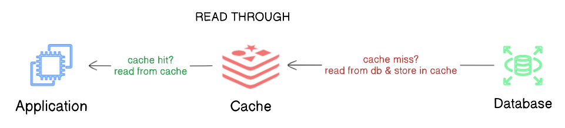
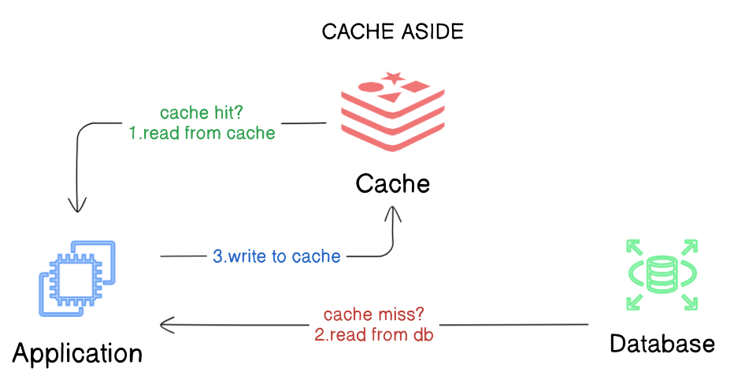
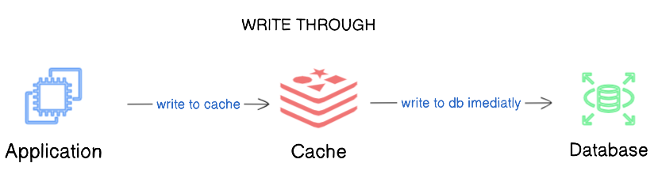
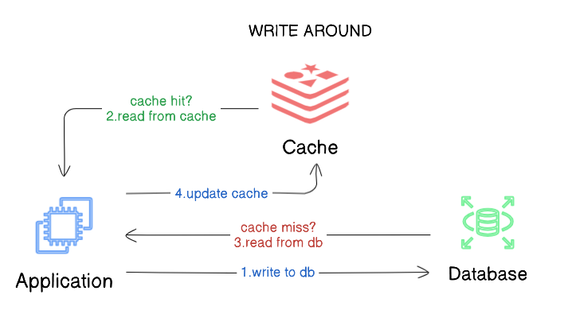
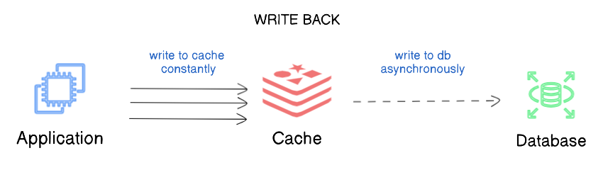
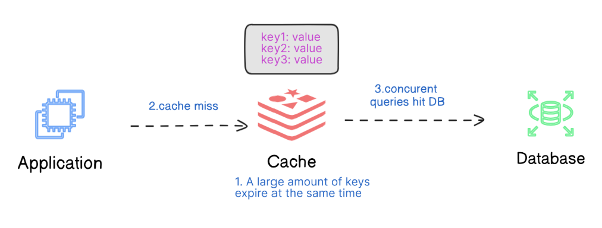
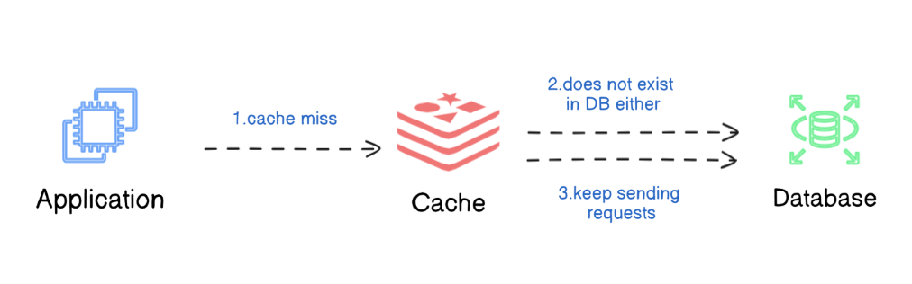
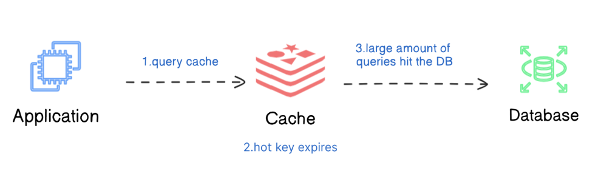
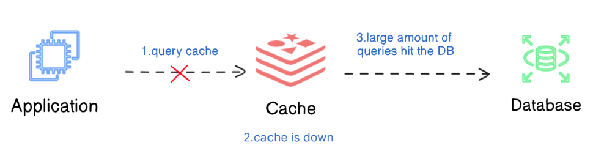

# Caching strategies

> Caching is a technique to improve system performance and reduce latency. 

There are several stragegies, depending on what a system needs, whether the focus is to optimize read or write heavy workloads, or ensure data consistency.

To avoid stale data, a **time-to-live(TTL)** can be added to cached data. When TTL expires data is to be reloaded from db.

## Read Through
In the **Read Through** strategy the cache acts as an intermediary between the application and the database.

When the application requests data, it first check in chache and if is present(**cache hit**) there return it,  if not(**cache miss**) the cache is responsible to read the data from db, store it for future use and return it back to the app.

{ style="display: block; margin: 0 auto" }

This basically simplify app logic as the it doesnt require to handle the logic for fetching data and updating the cache. This is handle by the cache automatically and minimize unnecesarry data in the cache and ensure that frequently acccessed data is readily available.

For **cache hits** Read Through provides low-latency data access, in case of **case misses** delays are expected. This means initial reads can result in higher latency.

> **Read Through caching** is best suited for read-heavy applications where data is accessed frequently but updated less often, such as a content delivery systems(CDNs), social media feeds, user profiles, etc...

## Cache Aside
**Cache Aside** aka **"Lazy Loading"** is a strategy where application code handles the interaction between the cache and the database. The data is loaded into the cache only when needed.

First apps checks cache for data, if exists it is returned if not the application takes it from database, after load it into the cache for subsequent requests.

{ style="display: block; margin: 0 auto" }

The cache acts as a "sidecar" to the database, and it is the responsability of the application to manage when and how the data is written to the cache. 

> **Cache Aside** is perfect for the systems where the read-to-write ratio is high, and data updates are infrequent. A good usage is an e-commerce website where product data(like prices, descriptions, stock status) is often read much more frequently than it is updated.

## Write Through
On the **Write Through** every write operation is executed on both cache and database on the same time.

This is a synchronous process, meaning both the cache and the database are updated as part of the same operation, ensuring that there is no delay in the data propagation.

{ style="display: block; margin: 0 auto" }

This approach ensure that the cache and the database remain synchronized and the reads requests from the cache will always return the latest data, avoiding risk of stale data.

Biggest advatage of this strategy is that it ensures strong **data consistency** between the cache and the database. Since cache always have latest data, **read operations** benefits from low latency. The downside appear as a consequence both writes on db and cache resulting in high latency for this operations.

> **Write Through** is ideal for consistency-critical systems, such as online transaction processing system, financial applications where the cache and database must always be in sync.

## Write Around
**Write Around** is a strategy where data is written directly in database, bypassing the cache. 
The cache is only updated when the data is requested later during a read operation, when the **Cache Aside** strategy comes in place and it is used to store data in cache.

{ style="display: block; margin: 0 auto" }

With this approach ensures that only **frequently accessed data** is persisted in cache. This keeps the cache clean by avoiding unneccessary data that might not be requesting after being written.

Writes are relatively faster because this targets the database and not imply a write in cache as well.

> **Write Around** is best used in **write-heavy systems** where data is frequently written or updated, but **not immediately or frequently read** such as logging systems.

## Write Back
In the **Write Back** strategy, data is first written in cache and then asynchronously written in the database at a later time. This is focusing to **minimize write latency** by deferring database writes.

This deffered writting means that the cache acts as the primary storage during the write operations, while the database is updated periodically in the background.

{ style="display: block; margin: 0 auto" }

Main advantage of this strategy is that it is significantly **reduces write latency** as the write in cache is quicker, and the database updates could be delayed or batched.

This can be mitigated by using persistent caching solutions like **Redis with AOF** (Append Only File), which logs every write operation to disk, ensuring data durability even if the cache crashes.

**Write Back** doesn't require cache invalidation as the cache itself becomes the source of truth.

>**Write Back** is ideal for **write-heavy** scenarios where write operatiopns needs to be **fast** and **frequent**, but **immediate consistency** with the database is not critical, such as logging systems and social media feeds.

## Summary

|    Strategy    | What it does | Write latency | Read latency | Data consistency | When to use |
|----------------|--------------|---------------|--------------|------------------|-------------|
| Read Through   | Cache auto-fetches from DB on reads | Moderate | Low after cache miss | May serve stale data | systems with auto cache management |
| Cache Aside    | Loads data into the cache on read | Low | Low after cache miss | May serve stale data | Read-heavy systems with infreq writes  |
| Write Through  | Writes in the same time to both cache and db| High | Low | Strong consistency | Consistency-critical systems like financial apps |
| Write Around   | Writes directly to DB, bypass cache | Low | High on initial read | May serve stale data | Write-heavy systems with infreq reads |
| Write Back     | Writes to cache firsts, DB later | Very Low | Low  | Eventual consitency(risk of data loss) | High-write throughput systems, eventual consistency |

@Credits:
https://blog.algomaster.io/p/top-5-caching-strategies-explained

# How can Cache Systems go wrong?

1. Thunder herd problem
{ style="display: block; margin: 0 auto" }

This happens when a large number of keys in the cache expire at the same time. Then the query requests directly hit the database, which overloads the database.
There are two ways to mitigate this issue: 
- one is to avoid setting the same expiry time for the keys, adding a random number in the configuration; 
- the other is to allow only the core business data to hit the database and prevent non-core data to access the database until the cache is back up.

2. Cache penetration
{ style="display: block; margin: 0 auto" }

This happens when the key doesn’t exist in the cache or the database. The application cannot retrieve relevant data from the database to update the cache. This problem creates a lot of pressure on both the cache and the database.

To solve this, there are two suggestions:
- One is to cache a null value for non-existent keys, avoiding hitting the database.
- The other is to use a bloom filter to check the key existence first, and if the key doesn’t exist, we can avoid hitting the database.

3. Cache breakdown
{ style="display: block; margin: 0 auto" }
This is similar to the thunder herd problem. It happens when a hot key expires. A large number of requests hit the database. 

Since the hot keys take up 80% of the queries, we do not set an expiration time for them. 

4. Cache crash
{ style="display: block; margin: 0 auto" }
This happens when the cache is down and all the requests go to the database. 

There are two ways to solve this problem:
- One is to set up a circuit breaker, and when the cache is down, the application services cannot visit the cache or the database
- The other is to set up a cluster for the cache to improve cache availability.

References:
https://en.wikipedia.org/wiki/Thundering_herd_problem
https://en.wikipedia.org/wiki/Bloom_filter
https://en.wikipedia.org/wiki/Circuit_breaker_design_pattern
