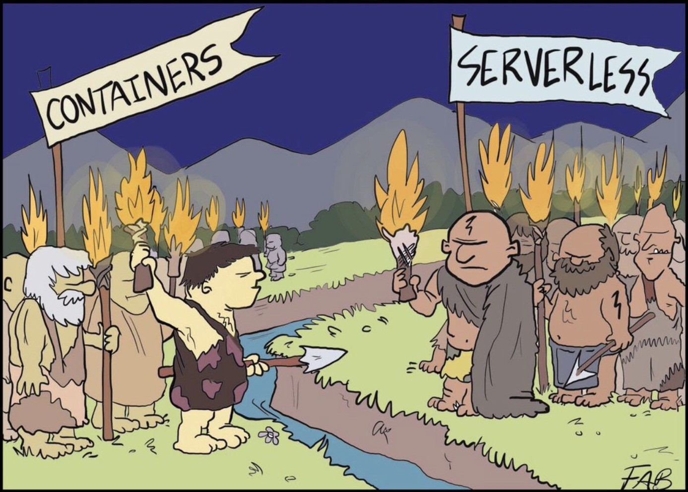

# FaaS and Furious: Containers vs. Serverless

**FaaS and Furious: The Two Tribes of Modern Cloud Development**

> "Two tribes regarded each other suspiciously in the glow of their brightly blazing production environments" - **Forrest Brazeal**

---

# The Cartoon

Inspired by Forrest Brazeal drawing "FaaS and Furious," this presentation dives into the modern debate (and convergence) between **Containers** and **Serverless** in cloud architecture.

---

# What the Tribes Represent

| Tribe      | Represents                                       |
| ---------- | ------------------------------------------------ |
| Containers | Docker, ECS, EKS, Kubernetes                     |
| Serverless | AWS Lambda, Azure Functions, GCP Cloud Functions |

---

# Core Philosophy & Control

| Aspect         | Containers                       | Serverless                         |
| -------------- | -------------------------------- | ---------------------------------- |
| Mindset        | Full control over stack          | Focus on logic and event responses |
| Responsibility | Manage OS, runtime, and infra    | Cloud manages most of the stack    |
| Deployment     | Image-based, custom buildpacks   | Function code or zipped bundles    |
| Runtime Access | Full (pick OS, language, tuning) | Limited to supported runtimes      |

---

# Runtime and Execution Model

| Factor            | Containers               | Serverless                                       |
| ----------------- | ------------------------ | ------------------------------------------------ |
| Process Lifecycle | Long-running, daemonized | Short-lived, event-driven                        |
| Background Tasks  | Native support           | Requires orchestration (e.g., Step Functions)    |
| Custom Runtime    | Full control             | Limited (unless using container image in Lambda) |

---

# Use Cases

| Use Case                   | Containers | Serverless          |
| -------------------------- | ---------- | ------------------- |
| APIs                       | Yes        | Yes                 |
| Batch jobs                 | Yes        | Yes (short-lived)   |
| Real-time image processing | Yes        | Yes                 |
| Long-running apps          | Yes        | No                  |
| Stateful workloads         | Yes        | No (stateless only) |

---

# Scaling and Cost

| Feature       | Containers                        | Serverless                          |
| ------------- | --------------------------------- | ----------------------------------- |
| Scaling Model | Manual or orchestrated (e.g. K8s) | Auto-scaling built-in               |
| Cold Starts   | Minimal (if warmed)               | Can be significant unless optimized |
| Idle Cost     | Incurred                          | None (pay-per-use)                  |
| Billing Model | Uptime                            | Per invocation + duration           |

---

# Architectural Mindset

| Area                    | Containers                          | Serverless                     |
| ----------------------- | ----------------------------------- | ------------------------------ |
| DevOps Involvement      | High                                | Low                            |
| Local Development       | Docker-native                       | Needs tools (SAM, LocalStack)  |
| Deployment Velocity     | Slower due to infra coupling        | High (focuses on code)         |
| Security Responsibility | Full (OS patching, image hardening) | Minimal (IAM + runtime config) |

---

# Confused Terms and Overlap

- **"Serverless" is not always function-based**
- **Containers can run inside Lambda now** (Lambda container image support)
- **Fargate** offers container-based workloads with serverless scaling
- **Kubernetes Event-Driven Autoscaling (KEDA)** brings event-based execution to containers

> The boundary is blurring. It's no longer "Containers vs. Serverless" but "How do they work together best?"

---

# Summary Comparison

| Category               | Containers             | Serverless            |
| ---------------------- | ---------------------- | --------------------- |
| Control                | Full                   | Minimal               |
| Abstraction Level      | Low                    | High                  |
| Scaling                | Manual or orchestrated | Built-in auto-scaling |
| Deployment Model       | Image-based            | Code/function-based   |
| Cold Start Sensitivity | Low                    | High (without tuning) |
| Cost at Idle           | High                   | Zero                  |

---

# Final Thought

> "Use containers when you need control, use serverless when you want focus."

The best systems today use both — containers for persistent services, serverless for rapid response.

---

# Q&A

Any questions or discussion points?
