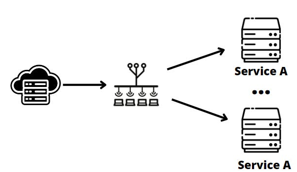
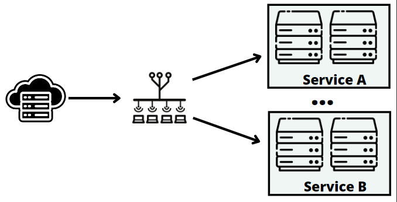
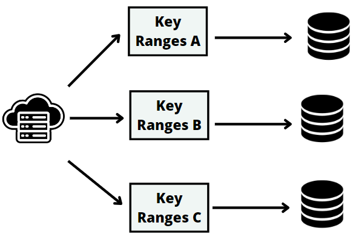

# Design system for scale

Designing systems that can work on a large scale is a hard yet critical skill for software engineers.

As your application grows and your user base gets bigger, the ability to handle increased load becomes increasingly important.

This week, we'll explore three key techniques for creating scalable systems that can grow with your needs.

Whether working at a small startup or a large company, understanding these approaches and their pros and cons will help you design more robust and flexible solutions.

The outline will be as follows:
* Adding server clones
* Partitioning servers by functionality
* Partitioning data

## Adding server clones
Adding clones is the simplest and least expensive way to scale a system from scratch.

This technique involves creating exact copies of your existing servers or components, allowing them to share the incoming load.

The key to this approach is ensuring that each clone is interchangeable. Any request should be able to go to any server and get the correct result.

You can typically use a load balancer to distribute requests among your clones. This component acts as a traffic cop, directing incoming requests to the available servers.

While this method is effective, it works best with stateless services. In such a setup, each request is independent, and servers don't need to keep track of the previous interactions. This makes it easy to add/remove servers to/from the pool without worrying about syncing their state.

In the ideal case, the load balancer should be able to send a request to any server without looking back at where the last request went.

While you can scale your servers also vertically by upgrading their hardware, adding clones is a form of horizontal scaling which its often more flexible and cost-effective, especially in cloud environments.

The main challenge with this approach is handling stateful services. If you have an application that needs to remember information between requests, you need to find ways to synchronize this state across all the server clones.

## Partitioning servers by functionality
Functional partitioning is a more advanced and flexible way to scale. This technique involves breaking your system into smaller and independent components. Each component is in charge of a specific functionality.

The approach is versatile, and you can apply it at various levels of abstraction.

From an infrastructure point of view, functional partitioning is about isolating different server roles. For instance, you might have separate servers for caching, storing data, message queues, and web services.

By doing this, you can scale these servers separately, giving resources where they're needed since their scalability needs will likely differ.

At a higher level of abstraction, functional partitioning means making applications or microservices that can run on their own.

For example, in an e-commerce application, you may have a profile service, a catalog service, a shopping cart service, and so on.

This way, multiple teams can work on different services at the same time without getting in the way of each other and can use the technology stack that works best for them.

The main challenge is that functional partitioning requires more management and initial effort. Moreover, there's a limit to how much you can partition your system before it becomes too complex.

## Data Partitioning
A third approach for scaling systems is dividing your dataset and distributing it across multiple machines, each having a subset of the data.

For example, if you have an e-commerce application with many users, you could split the user data on multiple servers. You can partition by username or use more sophisticated partitioning schemas, but the principle remains the same.

This setup has several benefits. It speeds up data processing and storage as each server only has to deal with a smaller amount of data at a time and can store more data in memory.

It also makes the system scalable, so as the amount of data grows, you can add more servers and change how the data is distributed between them.

Data partitioning, when done right, can allow for endless scalability. However, it's not a piece of cake. Data partitioning is complex and can be expensive to set up.

You need a system to track where each piece of data is stored to direct queries to the correct server. In addition, it can be hard to make queries that cover more than one data partition and work well.