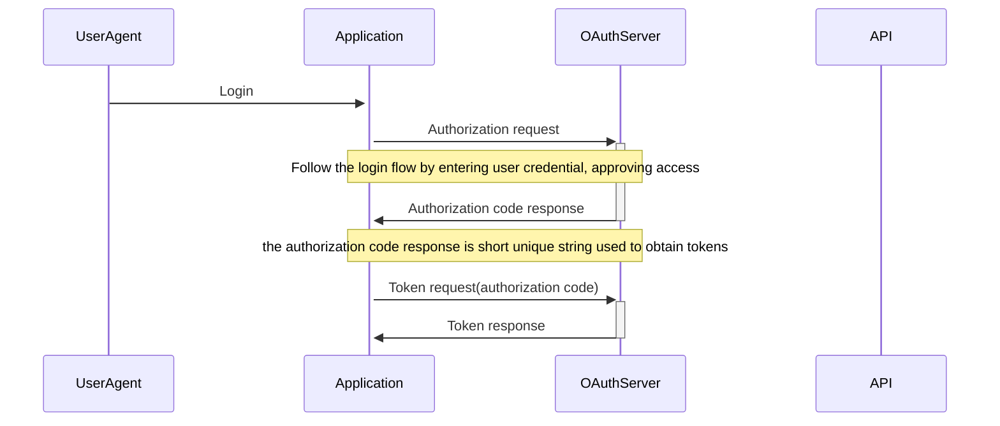

# OAuth
## Why OAuth?
> OAuth was created to limit/delegate access to data.
### Password anti-pattern
In the past when the new application was launching there was a feature to find out if your friends is using the application as well. For that specific usecase the application was demanding for a user to login with their google/yahoo email and password in order to pick/scrape your address book from that account(provider)

**Why this bad?** 
- you give access to your entire account(all data) even if you needed limited access to contacts
- there is no way to revoke that access given
- you fully trust that application to give your credentials

**How to let an 3rd party app access my data without giving it the password?**

Let's think as example of a hotel reception. You as client provides the ID card to receptionist and they give you a card that will **only give you access** to your room not entire hotel.

> **Authorization server**: receptionist

> **Access Token**: access card

> **Resource(API)**: room door

Trying to get access to gmail contact in a 3rd party app.
1. Open App & click login with gmail
2. App redirects to **account.google.com** the authorization server
3. on this server user puts user and password(remember this is google authorization server)
4. next step is for the user to read and allow access to specific resources for the app that initiated this process
5. once click allow a successfull screen will be shown
6. redirect to the app with an access token to be used in further communication with google services

## OpenID Connect
**OAuth** - access the APIs(giving the app a way to make the api calls)
**OpenID Connect** - used for identification(tell the application about the user authenticated) 

**OpenID** is not a new protocol, is just a small addition to **OAuth**

## Types of tokens
- **ACCESS Token** (OAuth) - read by API
- **ID Token** (OpenID) - read by App

## Roles in OAUTH

- 🤵 User (Resource Owner)
- 💻 Device (User agent)
- 🎛 Application (Client)
- 🕋 OAuth Server (Authorization server aka the token factory)
- ⚙️ API (Resource Server)

! In the specs you will find the naming from paranthesys.

## OAuth Client

The goal of the client is to *obtain the access token* and *use it* to *access the resources* ( APIs requests)

### OAuth flows
This describes ways to obtain the token. So we have categories: 

- Authorization Code (web, mobile, Single Page Applications)
- Device flow (CLI, browserless devices)
- Client Credentials (server-to-server)
- ~~Implicit~~ (deprecated and unsecure) - this was a shortcut of authorization code, it was an workaround for browsers not having [CORS(cross origin resource sharing)](https://www.google.com/url?sa=t&source=web&rct=j&opi=89978449&url=https://developer.mozilla.org/en-US/docs/Web/HTTP/CORS&ved=2ahUKEwis4tb4irKKAxX4ERAIHXXNK50QFnoECBcQAQ&usg=AOvVaw2xmyG8mpAqKyMiOwPBDkob)
- ~~Password~~ (deprecated and unsecure) - it was used to exchange the password for a token, being used in the past from migration of the apps that was storing user passwords to OAuth using the tokens

#### Authorization Code
Uses the redirect flow where the user is redirected to the authorization server and the ask for password and allow access and after thats done it gets redirect back to the app.

#### Device flow
- Scan your QR code from your device to login and authorize
- Enter activation code provided by entering for example nba.com/activate where you basically introduce your credentials

> All flows returns the **ACCESS TOKEN**

### Types of clients

- ⛓ Confidential Clients - application running on a server(this can keep strings secrets since runs in a safe environment)
- 🖥 Public Clients - application can't keep string secrets (browsers, mobile) like javascript/single page apps("view source"), native apps:

References:
[How to do a sequence diagram in readme file](https://mermaid.js.org/syntax/sequenceDiagram.html)