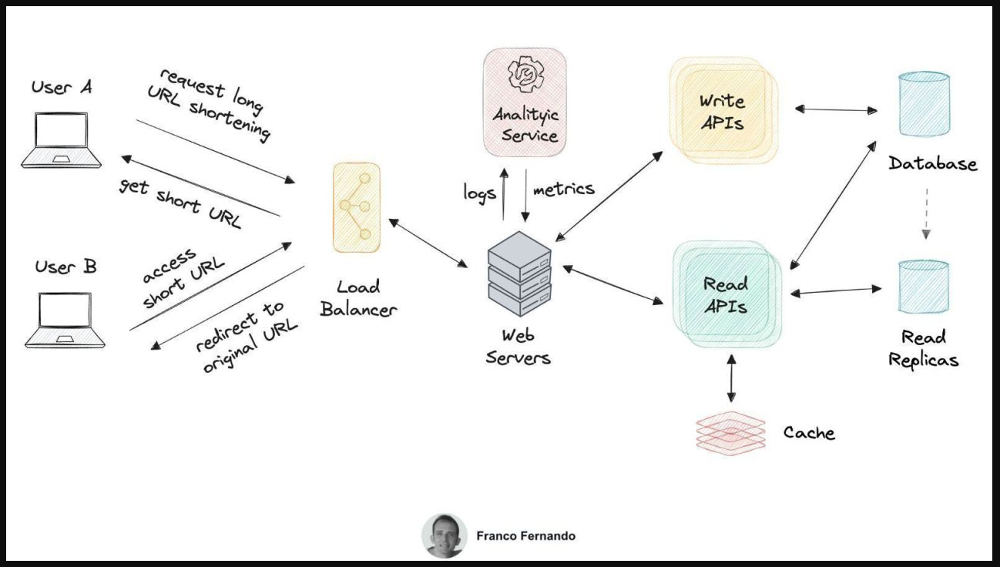

# How to design a URL shortener?

Here is how to answer with a step-by-step approach:

## Requirements

1. Functional requirements:
- A user enters a URL and gets back a short URL
- The short URL redirect to the long URL when accessed
- The lifetime of the short URL can be customized
- The usage of the short URL can be tracked for analytics

2. Non Functional requirements:
- High availability
- Minimal latency for URL redirection
- each short URL shall be unique

## Design the Data Model
We create three tables:
- **ShortURL** (urlId, creationDate, userID, longURL) -> ~= 500 bytes
- **User** (userId, creationDate, lastUpdate, email) -> ~= 100 bytes
- **UsageMetric** (metricId, url_id, timestamp, metric_type) -> ~= 200 bytes

**UsageMetric** has a one to many strong relationship with ShortURL.
**User** has a one to many weak relationship with ShortURL.

## Back of the Envelope estimation

> 10M users / create 3 URL per month -> 30M writes and 2B reads per month -> ~= 12 writes, 770 reads per second

## High level system design

There are two main data flows:
- request a short URL 
- and access a short URL. 

From the user device, each request hit the **Load Balancer** before going to a **web server**. Without the load balancer, the requests would be unevenly distributed to the servers, causing congestions and failures.

The functionalities for requesting and accessing a short URL are encapsulated by **two different set of APIs (*write* and *read* APIs)** handled by separated services.

To avoid single point of failures, the *database can be replicated* using a single-leader architecture. The *write requests go to the leader*, the *read requests to the replicas*. An **in-memory cache** is also used to reduce latency. Since the requests do not require any complex joins or strong relationships with data a NoSQL database using urlId as primary key fits the requirements.

## Analytic Service

A frontend web page sends requests to the analytic service and displays the analytics to the users. If real-time statistics are not required, the service can be implemented by batch jobs running at regular intervals.

All credits to: Franco Fernando